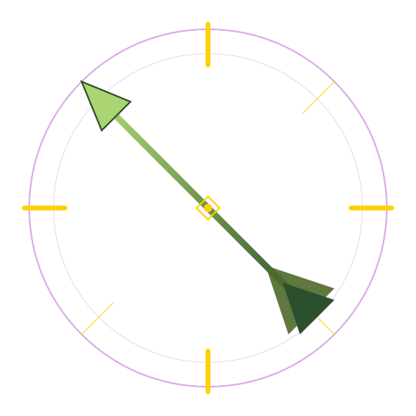

<p align="center">
  
</p>

# TrueShot

A World of Warcraft addon for Retail Midnight that layers rotation fixes on top of Blizzard's Assisted Combat system.

Blizzard's built-in rotation helper handles ~95% of ability prioritization correctly. TrueShot identifies the remaining cases where it doesn't and overrides them with cast-event-tracked heuristics.

## Supported Classes

TrueShot currently supports three classes with 14 hero-path-specific profiles. Hero path auto-detection works via `IsPlayerSpell` markers and switches automatically on talent changes.

### Hunter

All three Hunter specs are fully validated in-game with detailed cast-event state machines.

| Spec | Hero Path | Key Overrides |
|------|-----------|---------------|
| **Beast Mastery** | Dark Ranger | Black Arrow timing during Withering Fire, Wailing Arrow sequencing, Barbed Shot charge dump |
| **Beast Mastery** | Pack Leader | Bestial Wrath management, Nature's Ally KC weaving, Wild Thrash AoE |
| **Marksmanship** | Dark Ranger | Trueshot opener sequence (TS > BA > WA > BA), Volley/Trueshot anti-overlap, Withering Fire BA priority |
| **Marksmanship** | Sentinel | Post-Rapid Fire Trueshot gating, Volley anti-overlap, Moonlight Chakram filler timing |
| **Survival** | Pack Leader | Stampede KC sequencing after Takedown, WFB charge cap prevention, Takedown burst window |
| **Survival** | Sentinel | WFB charge management with near-cap cutoff, Moonlight Chakram timing, Takedown burst window |

### Demon Hunter

Havoc provides meaningful burst window tracking. Devourer is heavily AC-reliant due to hidden resource state (Souls, Voidfall stacks, Fury).

| Spec | Hero Path | Key Overrides |
|------|-----------|---------------|
| **Havoc** | Aldrachi Reaver | Metamorphosis burst window tracking, Essence Break timing during Meta |
| **Havoc** | Fel-Scarred | Metamorphosis burst window tracking, Essence Break timing during Meta |
| **Devourer** | Annihilator | Void Metamorphosis window tracking, phase detection |
| **Devourer** | Void-Scarred | Void Metamorphosis window tracking, phase detection |

### Druid

Both specs are heavily resource-dependent (Energy/CP for Feral, Astral Power for Balance). TrueShot provides burst window tracking and phase detection.

| Spec | Hero Path | Key Overrides |
|------|-----------|---------------|
| **Feral** | Druid of the Claw | Tiger's Fury + Berserk burst tracking, Berserk/TF alignment |
| **Feral** | Wildstalker | Tiger's Fury + Berserk burst tracking, Berserk/TF alignment |
| **Balance** | Keeper of the Grove | Celestial Alignment / Incarnation burst tracking |
| **Balance** | Elune's Chosen | Celestial Alignment / Incarnation burst tracking |

> **Note:** Demon Hunter and Druid profiles are based on Icy Veins rotation guides and Wowhead spell data. Spell IDs and burst window timers may need adjustment after in-game validation.

## How It Works

TrueShot is not a full rotation engine. It's an overlay:

1. **Blizzard Assisted Combat** provides the base recommendation via `C_AssistedCombat.GetNextCastSpell()`
2. **TrueShot PIN rules** override position 1 when a specific condition is met (e.g. "Black Arrow during Withering Fire")
3. **TrueShot PREFER rules** elevate a spell to position 1 as a softer suggestion
4. **Remaining positions** are filled from `C_AssistedCombat.GetRotationSpells()`

State tracking is purely event-driven via `UNIT_SPELLCAST_SUCCEEDED`. No buff reading, no resource tracking, no hidden state simulation.

## Display Features

- Compact queue overlay with configurable icon count
- **Masque support** for icon skinning (optional, zero-dependency)
- **First-icon scale** (1.0x - 2.0x) for visual hierarchy
- **Queue orientation** (LEFT / RIGHT / UP / DOWN)
- **Override glow** with pulsing animation (cyan for PIN, blue for PREFER)
- **Charge cooldown** edge ring for multi-charge spells (Barbed Shot, Aimed Shot, Wildfire Bomb)
- **DurationObject cooldown path** for secret-safe rendering on modern builds
- Keybind display, range indicator, cast success feedback
- Cooldown swipes (best-effort, respects Midnight restrictions)
- Optional backdrop toggle for clean floating-icons look
- Scrollable settings panel via `/ts options`
- Tiered update rates (10Hz combat, 2Hz idle, 0Hz hidden)

## Installation

1. Copy the `TrueShot` folder into:

```text
World of Warcraft/_retail_/Interface/AddOns/
```

2. Restart WoW or `/reload`.
3. Log into a supported class (Hunter, Demon Hunter, or Druid).

## Commands

| Command | Description |
|---------|-------------|
| `/ts options` | Open settings panel |
| `/ts lock` / `unlock` | Lock/unlock overlay position |
| `/ts burst` | Toggle burst mode |
| `/ts hide` / `show` | Toggle visibility |
| `/ts debug` | Show profile state |
| `/ts diagnostics on\|off` | Enable signal probes |
| `/ts probe ...` | Run signal probes (requires diagnostics) |

## Design Philosophy

TrueShot is built around the Midnight API reality:

- Primary combat state (buffs, resources, exact cooldowns) is restricted via secret values
- Assisted Combat remains the most reliable legal baseline
- Cast events (`UNIT_SPELLCAST_SUCCEEDED`) and spell charges (`C_Spell.GetSpellCharges`) are the primary non-secret signals

The addon is:
- **Conservative**: only overrides AC where it's demonstrably wrong
- **Transparent**: shows why it overrode AC (reason labels, phase indicators)
- **Fail-safe**: degrades gracefully to pure AC passthrough if signals are unavailable

## Framework Docs

- [Project Goals](docs/PROJECT_GOALS.md)
- [API Constraints](docs/API_CONSTRAINTS.md)
- [Framework Model](docs/FRAMEWORK.md)
- [Profile Contract](docs/PROFILE_CONTRACT.md)
- [Profile Authoring Guide](docs/PROFILE_AUTHORING.md)
- [Signal Validation](docs/SIGNAL_VALIDATION.md)

## License

Licensed under `GPL-3.0-or-later`. See [LICENSE](LICENSE).
